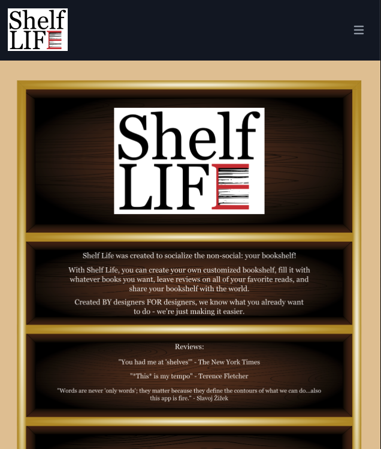
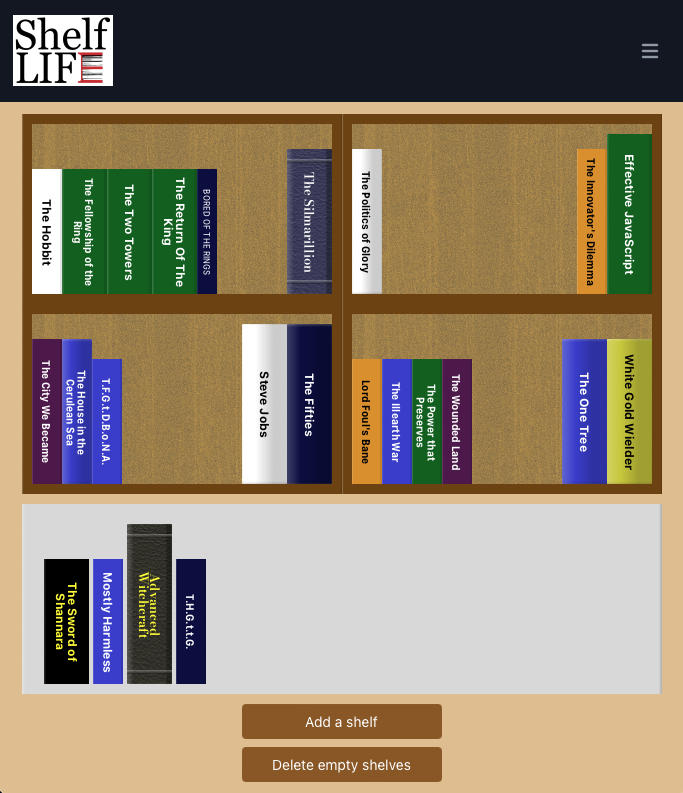
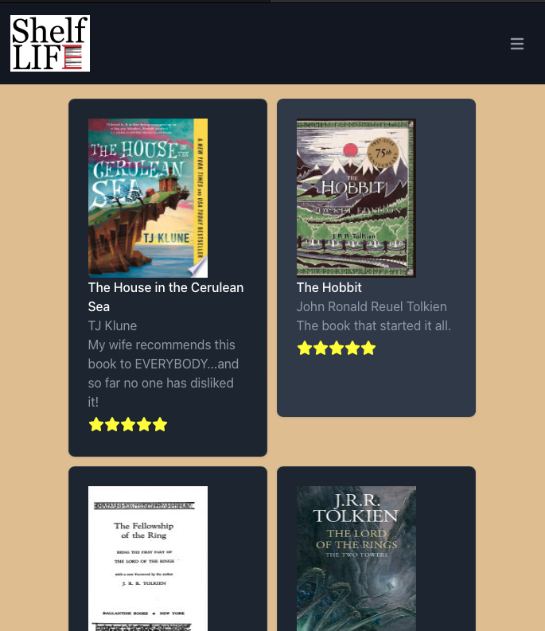
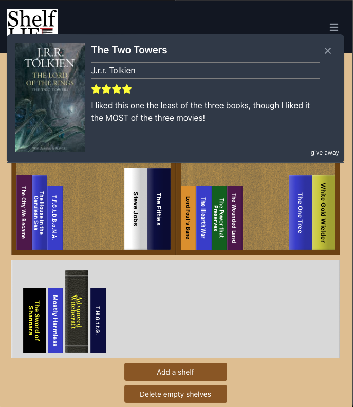

# Shelf Life 

## Description

Shelf Life is a dedicated book diary with a creative twist: not only can a user keep track of the books they've read, but can arrange them on a set of virtual bookshelves in creative ways. Not only can they place books on any shelf (and on either side), but they can customize the look of the books, in terms of width, height, color, and style. It's exactly the kind of creative outlet that many book lovers crave!

You can view and use Shelf Life [here](https://shelf-life.herokuapp.com).

## Table of Contents

- [Installation Instructions](#installation-instructions)
- [Usage Information](#usage-information)
- [Application Features](#application-features)
- [Credits](#credits)
- [Software License](#software-license)
- [Contact the Developer](#contact-the-developer)

## Installation Instructions

Shelf Life is a web app, and all it requires is a web browser to interact with it. Your web browser must have JavaScript turned on. To interact with any of the features of Shelf Life, you must sign up for a (currently free) account.

## Usage Information

Using Shelf Life is simple. First of all, the user must have an account. Visit the site, and click the "Log in/Sign up" link in the upper right. A modal will appear, including a link toggle at the bottom that enables the user to switch between logging in and creating an account. Provide a unique email address and username and a password to create the account.

Upon logging in, the user has two pages with which to interact with their library: a Bookcase page, and a Book List page. For a new account, both their bookcase and book list will be empty. Add a book to your library by clicking the "Add Book" link in the navbar. It will spawn a modal that includes a search field. Search for a title, author, or other keyword to generate a list of results. Click on any result to expose a form to assign various properties to the book: height, thickness, color, style, your personal rating, and any note or review to attach. Click to save the book, and it will appear both on the Book List page, and also in an "unshelved" area below the shelves on the Bookcase page.

Each shelf of the bookcase has two "stacks": one on the left, and one on the right. The user can rearrange their books to their heart's content by dragging and dropping on their bookcase. Shelve books from unshelved, rearrange books along a shelf, move them from one side of a shelf to the other, or move them from shelf to shelf.

If a user attempts to move a book onto a shelf that doesn't have enough room to accommodate it, the book will snap back to its original position. The user can drag a book off of the bookcase entirely by dragging the book into the unshelved area. Or they can double-click a book in the bookcase and it will jump immediately into unshelved. For a quick way to empty a shelf entirely, the user may double-click any empty region of the shelf

To create a new shelf, the user can click teh "Add a shelf" button below the unshelved area. The user can place a book already in the bookcase back into the unshelved area by dragging it there, or by double-clicking it. They can also clear an entire shelf, placing all of its books into the unshelved area, by double-clicking any open area of the shelf (including the small area between the top of a book and the shelf above).

To create more room in the bookcase, the user can click the "Add a shelf" button located below the unshelved area. Or, to remove empty shelves, they can click "Delete empty shelves" For layout reasons, there will always be an even number of shelves: "Add a shelf" adds two of them, which on a wide screen go side-by-side and a narrower screen one above the other.

The user can single-click any book in either the bookcase or the unshelved area to launch a modal with some information on the book, the user's comment, and a link to "Give book away", that is, remove it entirely from the library.

Using these tools, a user can populate their library with whatever books they please, in the styles they want, and arranged on their bookcase (or not) as they see fit.

In addition to the Bookcase, there is also a card-based Book List, which gives the user a different view of their book diary. Each card has an image of the book's cover, its author(s), and the user's rating and comment.

## Application Features

- Add and remove any book from the library
- Optionally give each book a rating and a comment
- Style each book individually to customize its appearance in the user's bookcase
- Place the books in any order on any shelf of their bookcase by clicking and dragging
- Rearrange books as you please by clicking and dragging from one location to another
- View more information on the book either on the Book List page, or by clicking on the book in the Bookcase
- Clear a shelf with a single double-click to place all its books at once into "unshelved"
- Add shelves with a button click, and quicly remove empty shelves with another one

## Credits

Shelf Life was created by [Safia Ali](https://www.linkedin.com/in/safia-ali-840b53268/), [Ashton Balder](https://www.linkedin.com/in/ashton-balder-0138831a2/), [Justin Brueske](https://github.com/Justin-Brueske), [Micheala Holthus](https://github.com/Micheala-H) and [Lee Klusky](https://www.linkedin.com/in/lee-klusky/). We built Shelf Life on technologies like [React](https://react.dev), [Node](https://nodejs.org), [Express](https://expressjs.com), [Tailwind](https://tailwindcss.com), [Recoil](https://recoiljs.org), [React Beautiful DnD](https://www.npmjs.com/package/react-beautiful-dnd) and more. To the contributors to these open-source projects, we give our great thanks.

This application would also not exist if it were not for the help, guidance and wisdom of the instructional staff of the [University of Minnesota Full Stack Coding Bootcamp](https://bootcamp.umn.edu/coding/): [Jack Linhard](https://www.linkedin.com/in/jack-linhart/), [Daniel Vitelli](https://www.linkedin.com/in/daniel-vitelli/), [Dillon Riecke](https://www.linkedin.com/in/dillon-riecke/) and [Konner Hartman](https://www.linkedin.com/in/konner-hartman/).

And of course we owe gratitude to content providers of all types at places like [Stack Overflow](https://www.stackoverflow.com), the [Mozilla Developer Network](https://developer.mozilla.org) and [W3Schools](https://w3schools.com).

## Software License

©2023, Lee Klusky, Justin Brueske, Safia Ali, Ashton Balder and Micheala Holthus

This software is covered by a [MIT License](https://opensource.org/licenses/MIT).

Permission is hereby granted, free of charge, to any person obtaining a copy of this software and associated documentation files (the "Software"), to deal in the Software without restriction, including without limitation the rights to use, copy, modify, merge, publish, distribute, sublicense, and/or sell copies of the Software, and to permit persons to whom the Software is furnished to do so, subject to the following conditions:

The above copyright notice and this permission notice shall be included in all copies or substantial portions of the Software.

THE SOFTWARE IS PROVIDED "AS IS", WITHOUT WARRANTY OF ANY KIND, EXPRESS OR IMPLIED, INCLUDING BUT NOT LIMITED TO THE WARRANTIES OF MERCHANTABILITY, FITNESS FOR A PARTICULAR PURPOSE AND NONINFRINGEMENT. IN NO EVENT SHALL THE AUTHORS OR COPYRIGHT HOLDERS BE LIABLE FOR ANY CLAIM, DAMAGES OR OTHER LIABILITY, WHETHER IN AN ACTION OF CONTRACT, TORT OR OTHERWISE, ARISING FROM, OUT OF OR IN CONNECTION WITH THE SOFTWARE OR THE USE OR OTHER DEALINGS IN THE SOFTWARE.

## Questions?

Contact me at <a href="mailto:lkbootcamp@yahoo.com">lkbootcamp@yahoo.com</a>, or visit my [GitHub profile](https://www.github.com/lkalliance).
